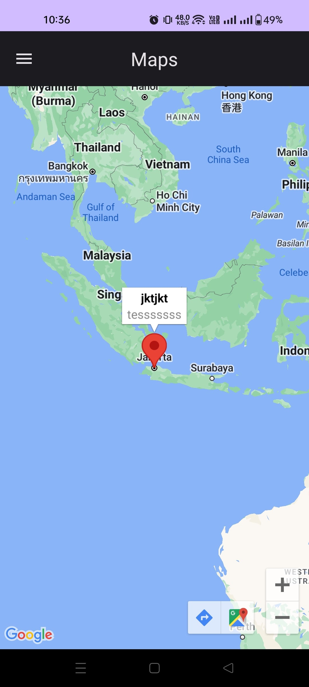
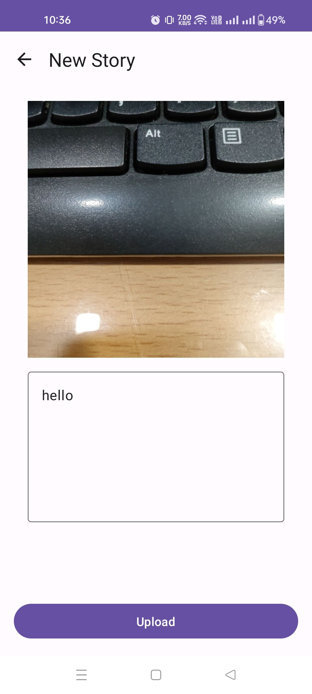

# Dicoding Story With Jetpack Compose

## Introduction
This project is an example to review my knowledge about Jetpack Compose, shows how to do the
following:
* Create custom composable components and reuse them
* Handle network calls using Retrofit
* Handle JWT session token after authenticated using Preferences DataStore
* Handle multiple runtime permissions such as camera and location
* Use Google Maps SDK
* Handle Dependency Injection using Dagger Hilt 
* Apply Clean Architecture MVVM (Model-View-ViewModel) pattern

## Use Cases
This project has several use cases such as:
* Authentication 
  * Login
  * Registration
* Main
  * Home - shows lists of stories
  * Add Story - users can add/capture a photo, write a description and upload it
  * Maps - shows Google Maps and marks stories location
  * About - shows a dummy page

## Preview
Register, Login, Home and Maps
<p float="left">



</p>
<br>

Add Story, Camera and Gallery
<p float="left">





</p>

## Dependency
* Navigation Compose
* Retrofit and OkHttp
* Preferences DataStore
* Dagger Hilt
* Coil Compose
* CameraX
* Compressor by zetbaitsu
* Google Location Services, Maps and Maps Compose

# Getting Started

This project can be build and run by following these instructions:
1. Clone or Download this project
2. Install Android Studio and open the project. (I am using Android Studio Dolphin)
3. In the project root directory, create `local.properties` file (if the file does not exist), then add your Google Maps API Key.
```gradle
GOOGLE_MAPS_API_KEY=YOUR_API_KEY
```

**Note:**
To reference the API Key in `local.properties`, you will need the `com.google.android.libraries.mapsplatform.secrets-gradle-plugin` installed.
See my [build.gradle (project)](https://github.com/ryandharmawira/DicodingStoryCompose/blob/master/build.gradle.kts).
Then in `AndroidManifest.xml`, update the code within the `<application>` tag.
```
<application
   ...
   ... >
   <meta-data
	  android:name="com.google.android.geo.API_KEY"
	  android:value="${GOOGLE_MAPS_API_KEY}"/>
</application>
```

## Obtain Google Maps API Key Without Billing Account

1. Generate your device SHA certificate by opening your Terminal inside your Android Studio project
2. Copy the link below, replace `11:22:33:44:55:66:77:88:99:00:AA:BB:CC:DD:EE:FF:01:23:45:67` with your SHA1 and `com.packagename.appname` (in this case `com.ryan.dicodingstorycompose`) with your root package name.
```
https://console.developers.google.com/flows/enableapi?apiid=maps_android_backend&keyType=CLIENT_SIDE_ANDROID&r=11:22:33:44:55:66:77:88:99:00:AA:BB:CC:DD:EE:FF:01:23:45:67%3Bcom.packagename.appname
```
3. Then your API Key is generated, usually starts with `AIza...`.